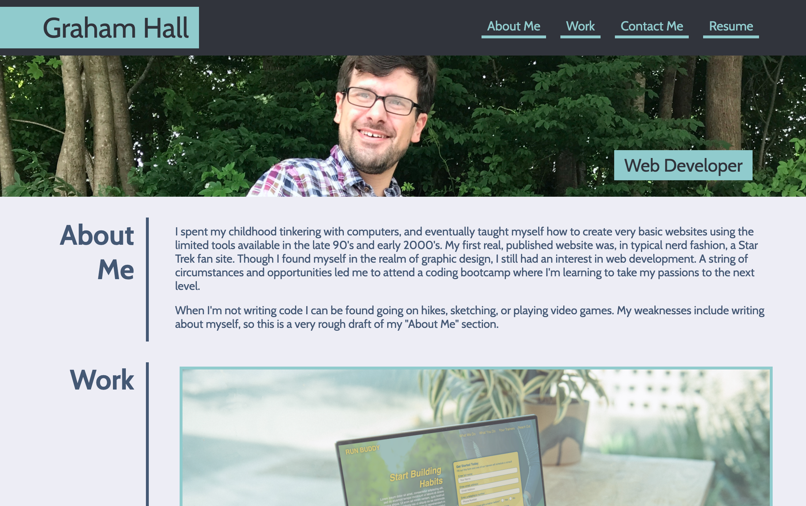

# Portfolio Page

## Description 

A website that introduces me, provides a portfolio of my web development work, and presents contact info for potential employers. The page itself was made using CSS flexbox to create the layout, and media queries to adjust layout and styles based on screen size. Pseudo-selectors were used to create interactive hover effects, and to exclude certain semantic elements based on ID. 

Finally, I put a few extra touches onto the page. I used some prior experience with Google Fonts to implement a typeface similar to match the one used in the mockup. I also looked into how to implement a smooth scroll when the links in 'nav' take the user to another point on the page. 

## Built With
* HTML
* CSS

## Website 

[https://ghall89.github.io/module-2-challenge](https://ghall89.github.io/module-2-challenge)
